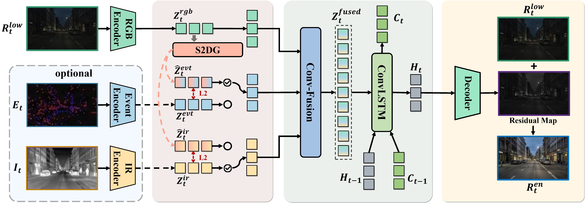

<div align="center">

<h1>AnyMod-LLVE: Low-Light Video Enhancement with Modality-Agnostic Inference</h1>

<p>
  <a href="https://arxiv.org/abs/2606.11186">
    
  </a>
  <a href="https://lhfgghc.github.io/LLVE-AMNet/">
    
  </a>
  <a href="./docs/assets/posters/AMNet%20Poster.jpg">
    
  </a>
  
</p>
</div>

---

Official implementation of **AMNet**, a unified multimodal framework for **low-light video enhancement (LLVE)** with modality-agnostic inference.

> Unlike existing multimodal LLVE methods that require auxiliary modalities (e.g., events or infrared images) at test time, **AMNet** can leverage available modalities when present and remain robust when they are absent — via implicit modality generation.

---

## 📋 Table of Contents

- [Framework](#-framework)
- [Installation](#-installation)
- [Getting Started](#-getting-started)
  - [Pretrained Weights](#1-download-pretrained-weights)
  - [Prepare Datasets](#2-prepare-datasets)
  - [Training](#3-training)
- [Citation](#-citation)
- [License](#-license)

---

## 🏗 Framework

<p align="center">
  
</p>

---

## 🔧 Installation

```bash
conda create -n amnet python=3.10 -y
conda activate amnet
pip install torch torchvision --index-url https://download.pytorch.org/whl/cu121
pip install einops pytorch-msssim pyyaml timm Pillow numpy tqdm
```

---

## 🚀 Getting Started

### 1. Download Pretrained Weights

Download the pretrained checkpoint and place it under `checkpoints/`:

```
checkpoints/
└── amnet_pretrained.pth
```

> 📥 **Download:** [amnet_pretrained.pth](https://drive.google.com/file/d/1Jyo9xI5ymPHFdB56Gq83hbCSjswfi3PK/view?usp=drive_link)
>
> All training configs share this same pretrained model for fine-tuning.

---

### 2. Prepare Datasets

Edit the `root` field in the corresponding config under `configs/experiments/amnet/`:

| Config | Dataset |
|--------|---------|
| `amnet/did/rgb_only_ft.yaml` | DID-1080 |
| `amnet/sdsd/sdsd_in_rgb.yaml` | SDSD Indoor |
| `amnet/sdsd/sdsd_out_rgb.yaml` | SDSD Outdoor |
| `amnet/sde/sde_in_mm.yaml` | SDE Indoor |
| `amnet/sde/sde_out_mm.yaml` | SDE Outdoor |

---

### 3. Training

Use the provided shell scripts:

```bash
bash run_train_did.sh         # DID-1080 (RGB)
bash run_train_sdsd_in.sh     # SDSD Indoor (RGB)
bash run_train_sdsd_out.sh    # SDSD Outdoor (RGB)
bash run_train_sde_in_mm.sh   # SDE Indoor (RGB + Event)
bash run_train_sde_out_mm.sh  # SDE Outdoor (RGB + Event)
```

Or run directly with a config:

```bash
python scripts/train.py --cfg configs/experiments/amnet/<config>.yaml
```

---

## 📖 Citation

If you find this work useful, please cite:

```bibtex
@misc{liang2026amnet,
  title={AnyMod-LLVE: Low-Light Video Enhancement with Modality-Agnostic Inference},
  author={Hangfeng Liang and Yutao Hu and Yanhan Hu and Xiaohan Wu and Wenqi Shao and Ying Fu},
  year={2026},
  eprint={2606.11186},
  archivePrefix={arXiv},
  primaryClass={cs.CV},
  url={https://arxiv.org/abs/2606.11186}
}
```

---

## 📄 License

This project is released under the **MIT License**. See [LICENSE](LICENSE) for details.
